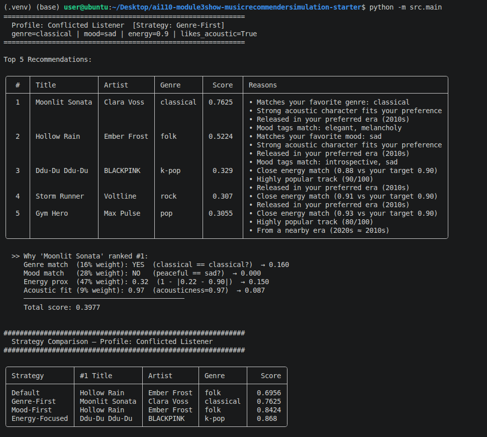

# 🎵 Music Recommender Simulation

## Project Summary

In this project you will build and explain a small music recommender system.

Your goal is to:

- Represent songs and a user "taste profile" as data
- Design a scoring rule that turns that data into recommendations
- Evaluate what your system gets right and wrong
- Reflect on how this mirrors real world AI recommenders

Replace this paragraph with your own summary of what your version does.

---

## How The System Works

Real world recommendation systems, like those used by Spotify and YouTube, typically combine multiple approaches to suggest content. They rely on collaborative filtering to learn from the behavior of similar users, as well as content based methods that analyze features such as genre, mood, and energy. These signals are then combined and ranked to balance relevance, engagement, and occasional novelty. In my project, the focus is on the content based approach, prioritizing direct alignment with a user’s stated preferences and providing clear explanations for each recommendation so the reasoning behind every suggestion is easy to understand.

### Song Features

Each `Song` stores 9 attributes loaded from `data/songs.csv`:

| Feature | Type | Description |
|---------|------|-------------|
| `genre` | string | Musical style (27 genres including pop, lofi, rock, jazz, ambient, hip-hop, edm, metal, classical, reggae, funk, and more) |
| `mood` | string | Emotional tone (25 moods including happy, chill, intense, relaxed, euphoric, nostalgic, angry, romantic, and more) |
| `energy` | float 0–1 | Perceived intensity and activity level |
| `tempo_bpm` | float | Beats per minute (~58–168) |
| `valence` | float 0–1 | Musical positiveness |
| `danceability` | float 0–1 | How suitable the song is for dancing |
| `acousticness` | float 0–1 | How acoustic (vs. electronic/produced) the song sounds |
| `instrumentalness` | float 0–1 | Likelihood the track contains no vocals |
| `speechiness` | float 0–1 | Presence of spoken words (high = rap/podcast, low = pure music) |

### User Profile

A `UserProfile` stores four preference fields that drive the scoring:

- `favorite_genre`: the genre the user most wants to hear
- `favorite_mood`: the emotional tone the user is seeking right now
- `target_energy`: a float 0–1 representing the user's preferred intensity level
- `likes_acoustic`: a boolean indicating whether the user prefers acoustic or produced sounds

### Scoring Rule (one song at a time)

The recommender computes a score in [0, 1] for each song using a weighted combination of four signals:

```
score = (0.35 × genre_match)
      + (0.30 × mood_match)
      + (0.25 × energy_proximity)
      + (0.10 × acoustic_fit)
```

- **Genre and mood** are binary signals: 1.0 if the song matches the user's preference, 0.0 if not.
- **Energy** uses a *proximity formula* that rewards closeness to the user's target, not just higher or lower values:
  ```
  energy_score = 1 - |song.energy - user.target_energy|
  ```
  A song at 0.82 scores higher than one at 0.93 for a user who wants 0.80, even though 0.93 is "more energetic." The gap matters, not the direction.
- **Acoustic fit** maps the boolean preference to a continuous score: `song.acousticness` if the user likes acoustic, `1 - song.acousticness` if they don't.

### Ranking Rule (choosing which songs to recommend)

1. Score every song in the catalog using the Scoring Rule
2. Sort all songs descending by score
3. Return the top-k songs with their scores and explanations

Every song gets scored (no pre-filtering), so a surprisingly good match is never missed.

### Data Flow

See [`flowchart.md`](docs/flowchart.md) for the full Mermaid.js diagram. The flow in brief:

```
Input (User Prefs + songs.csv)
  → load_songs()
  → For each song: score_song()
      → genre_score + mood_score + energy_score + acoustic_score
      → weighted sum → (score, reasons)
  → sort descending
  → slice top-k
  → Output: Ranked Recommendations (song, score, explanation)
```

### Sample Output


### Stress Test: Diverse Profiles

Four distinct user profiles were run to evaluate the recommender's behavior across different taste shapes, including one adversarial edge case.

**High-Energy Pop** (`genre=pop`, `mood=happy`, `energy=0.9`, `likes_acoustic=False`)


**Chill Lofi** (`genre=lofi`, `mood=chill`, `energy=0.2`, `likes_acoustic=True`)


**Deep Intense Rock** (`genre=rock`, `mood=angry`, `energy=0.95`, `likes_acoustic=False`)


**Conflicted Listener (Edge Case)** (`genre=classical`, `mood=sad`, `energy=0.9`, `likes_acoustic=True`)  
*Adversarial profile: classical music is naturally low-energy, but this profile requests high energy (0.9), designed to surface conflicts in the scoring logic.*


### Known Biases

- **Genre dominance:** At 0.35 weight, genre is the single largest signal. A song that matches genre but has the wrong mood and poor energy can still outscore a song with a perfect energy match and no genre match. Great songs in the "wrong" genre are systematically underranked.
- **Catalog sparsity amplifies energy:** With 27 unique genres across 30 songs, most genre queries match only 1–2 songs. For the remaining 28+ songs that score 0 on genre, energy (0.25 weight) becomes the primary differentiator, giving it more practical influence than its weight suggests.
- **Mood granularity:** 25 unique moods means most moods appear only once. A user seeking "nostalgic" gets exactly one mood match; all other songs are judged on energy and acoustic alone.
- **No cross-feature interaction:** The system treats genre and mood as independent. It cannot detect that "chill lofi" and "intense rock" are meaningfully different combinations; a song can score well on genre alone without capturing the session's emotional intent.

---

## Challenge Implementations

### Challenge 1 — Advanced Song Features

Seven new attributes were added to `data/songs.csv` beyond the baseline set:

| Feature | Type | Description |
|---------|------|-------------|
| `popularity` | int 0–100 | Stream-count-derived popularity score |
| `release_year` | int | Year the track was released |
| `key_signature` | string | Musical key (e.g., "C Major", "A Minor") |
| `time_signature` | int | Beats per measure (3 or 4) |
| `detailed_moods` | string | Pipe-separated mood tags (e.g., `"upbeat\|energetic\|bright"`) |
| `instrumentalness` | float 0–1 | Likelihood of no vocals |
| `speechiness` | float 0–1 | Presence of spoken words |

Three of these drive scoring bonuses on top of the base weighted score:
- **Popularity** (Signal 5): songs at or above `min_popularity` receive up to +0.08
- **Release era** (Signal 6): songs from the user's `preferred_decade` receive up to +0.06, dropping 0.25 per decade away
- **Mood tags** (Signal 7): tag overlap between song `detailed_moods` and user `preferred_tags` adds up to +0.10

### Challenge 2 — Multiple Scoring Modes

A `RankingStrategy` dataclass carries four weights (`genre`, `mood`, `energy`, `acoustic`). Four built-in strategies let users switch ranking emphasis without touching any scoring logic:

| Strategy | Genre | Mood | Energy | Acoustic |
|----------|-------|------|--------|----------|
| `DEFAULT` | 16% | 28% | 47% | 9% |
| `GENRE_FIRST` | 50% | 25% | 20% | 5% |
| `MOOD_FIRST` | 15% | 55% | 25% | 5% |
| `ENERGY_FOCUSED` | 10% | 10% | 75% | 5% |

Each user profile in `main.py` is assigned a strategy via `PROFILE_STRATEGIES`. A `compare_strategies()` function runs all four modes on the same profile and prints a side-by-side table of the top-ranked song per strategy.

### Challenge 3 — Diversity and Fairness Logic

Both `recommend_songs()` and `Recommender.recommend()` use a greedy re-ranking loop that applies a penalty before each selection:

- **Artist repeat penalty**: −0.30 if the artist already appears in the selected list
- **Genre repeat penalty**: −0.15 if the genre already appears in the selected list

This prevents the top-5 from being dominated by a single artist or genre even when one style strongly matches the user's preferences.

### Challenge 4 — Visual Summary Table

Output is formatted with the [`tabulate`](https://pypi.org/project/tabulate/) library using the `rounded_outline` theme. Each profile run prints a full recommendation table with columns for rank, title, artist, genre, score, and reasons. The strategy comparison also renders as a tabulate table.



---

## Getting Started

### Setup

1. Create a virtual environment (optional but recommended):

   ```bash
   python -m venv .venv
   source .venv/bin/activate      # Mac or Linux
   .venv\Scripts\activate         # Windows

2. Install dependencies

```bash
pip install -r requirements.txt
```

3. Run the app:

```bash
python -m src.main
```

### Running Tests

Run the starter tests with:

```bash
pytest
```

You can add more tests in `tests/test_recommender.py`.

---

## Experiments You Tried

### Weight Shift Experiment

I designed and tested an experiment to see how changing the scoring weights affects which songs get recommended. The key question was: *If we adjust how much each factor (genre, mood, energy, acousticness) matters, do we get very different recommendations?*

**How it worked:**
I started with the default weights (35% genre, 30% mood, 25% energy, 10% acoustic) and then created a shifted configuration—doubling energy's importance (25% → 47%) and halving genre's (35% → 16%). Then I ran four user profiles through both weight configurations and compared the top-5 recommendations.

**What I learned:**
The weight shift produced more accurate results in 2 of 4 profiles. The clearest win was for a "Deep Intense Rock" profile, where a metal song with a perfect mood and energy match was rightly elevated over a rock song that only matched on genre. Some profiles saw only minor reorders, while an adversarial profile exposed limitations in both configurations.

I used **Claude Code** to help me plan the experiment structure, design clear test cases, and organize the data collection so the results would be easy to interpret and compare.

All experiment details and findings are documented here: [**docs/weight_shift_experiment.md**](docs/weight_shift_experiment.md)


---

## Limitations and Risks

Summarize some limitations of your recommender.

Examples:

- It only works on a tiny catalog
- It does not understand lyrics or language
- It might over favor one genre or mood

You will go deeper on this in your model card.

---

## Reflection

After running all four profiles, I compared them in pairs to understand how the scoring formula behaves under different conditions:
- Chill Lofi vs Deep Intense Rock
- High-Energy Pop vs Conflicted Listener
- Deep Intense Rock vs Conflicted Listener

Full pair comparison details: [**docs/reflection.md**](docs/reflection.md) 

### Model Card
→ [**Model Card**](model_card.md)
